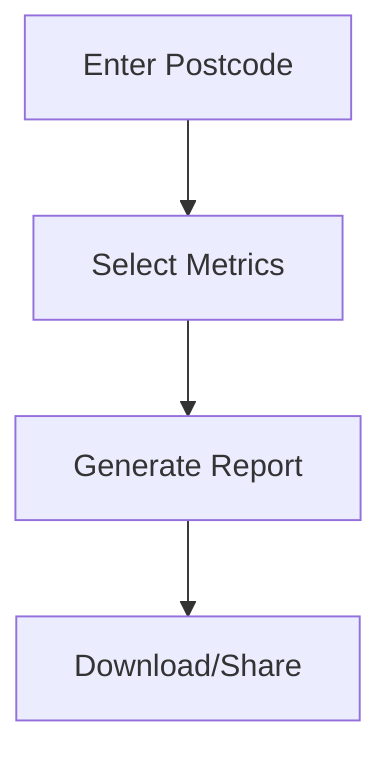

## Overview

Market Trak Pro empowers UK estate agents with tools to generate hyper-local market insights, create professional content, capture leads automatically, and schedule posts across social platforms. Focus on your local patch while the platform handles data analysis and distribution.

<Columns cols={2}>
  <Card title="Market Reports" icon="bar-chart-3" href="#creating-reports">
    Build seller's guides and data sheets from live UK property data.
  </Card>
  <Card title="Content Customization" icon="edit-3" href="#customizing-formats">
    Tailor reports into articles or social-ready posts.
  </Card>
  <Card title="Lead Capture" icon="mouse-pointer" href="#lead-capture">
    Add opt-in forms to reports for automatic lead collection.
  </Card>
  <Card title="Social Scheduling" icon="calendar" href="#social-scheduling">
    Post content directly to platforms with one click.
  </Card>
</Columns>

## Creating Hyper-Local Market Reports

Start by generating reports based on postcode or area data. Market Trak Pro pulls from live UK property sources for accuracy.

<Steps>
  <Step title="Select Location" icon="map-pin">
    Enter a postcode like `SW1A 1AA` or select your patch on the map.
  </Step>
  <Step title="Choose Metrics" icon="trending-up">
    Pick key stats: average prices, sales volume, time on market.
  </Step>
  <Step title="Generate Report" icon="download">
    Click Generate. Download as PDF or view preview.
  </Step>
</Steps>

<Callout kind="tip">
  Use historical data filters for year-over-year comparisons to highlight market trends.
</Callout>



## Customizing Report Formats

Adapt reports to your needs with three formats: seller's guides for leads, data sheets for quick facts, and articles for content marketing.

<Tabs>
  <Tab title="Seller's Guide" icon="file-text">
    <Steps>
      <Step title="Add Branding">
        Upload your logo and colors (`#3B82F6` for Market Trak Pro).
      </Step>
      <Step title="Include CTA">
        Add "Contact for valuation" with your details.
      </Step>
    </Steps>
  </Tab>
  <Tab title="Data Sheet" icon="table">
    Focus on charts and stats.
````javascript
{
  "postcode": "SW1A 1AA",
  "avgPrice": "£1,250,000",
  "salesYoY": "+15%"
}
````
  </Tab>
  <Tab title="Article" icon="book-open">
    Convert to blog post with narrative.
    <Expandable title="Advanced Styling">
      Customize fonts and layouts via dashboard.
    </Expandable>
  </Tab>
</Tabs>

## Automating Lead Capture with Opt-In Forms

Embed forms in reports to collect seller inquiries directly.

<CodeGroup tabs="JavaScript,HTML">
````javascript
// Embed form in your site
fetch('https://api.example.com/v1/leads', {
  method: 'POST',
  headers: { 'Authorization': 'Bearer YOUR_API_KEY' },
  body: JSON.stringify({
    postcode: 'SW1A 1AA',
    email: 'seller@example.com'
  })
});
````
````html
<form action="https://api.example.com/v1/leads" method="POST">
  <input name="email" type="email" placeholder="Your email" required>
  <input name="postcode" type="text" placeholder="Postcode" required>
  <button type="submit">Get Report</button>
</form>
````
</CodeGroup>

<ParamField path="postcode" param-type="string" required="true">
  UK postcode for hyper-local targeting.
</ParamField>

<ParamField body="email" param-type="string" required="true">
  Lead's contact email.
</ParamField>

## Scheduling and Posting to Social Platforms

Automate content distribution to build visibility.

<Tabs>
  <Tab title="LinkedIn" icon="linkedin">
    Schedule posts with images from reports.
  </Tab>
  <Tab title="Facebook" icon="facebook">
    Target local groups automatically.
  </Tab>
  <Tab title="Instagram" icon="instagram">
    Generate carousel posts from data sheets.
  </Tab>
</Tabs>

<Callout kind="success">
  Connect your accounts once in Settings for seamless posting.
</Callout>

<Columns cols={3}>
  <Card title="Quickstart" icon="zap" href="/quickstart">
    Set up in 5 minutes.
  </Card>
  <Card title="Authentication" icon="shield" href="/authentication">
    Secure your API access.
  </Card>
  <Card title="Changelog" icon="git-branch" href="/changelog">
    Latest features.
  </Card>
</Columns>